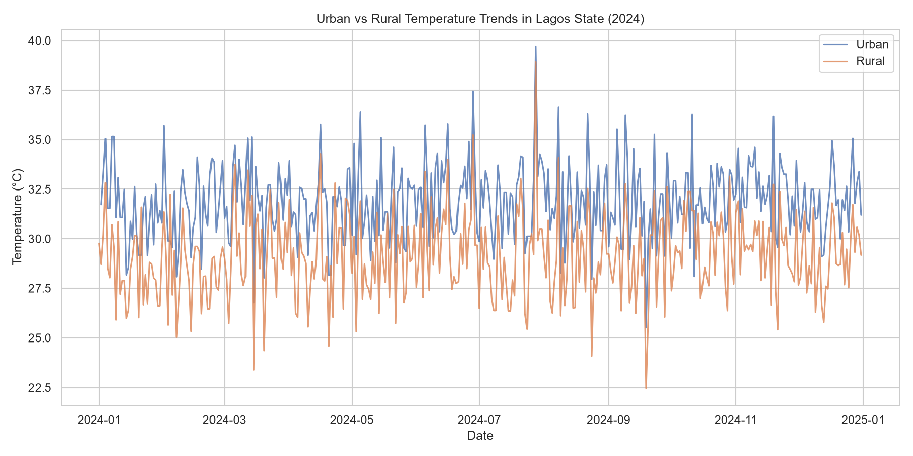
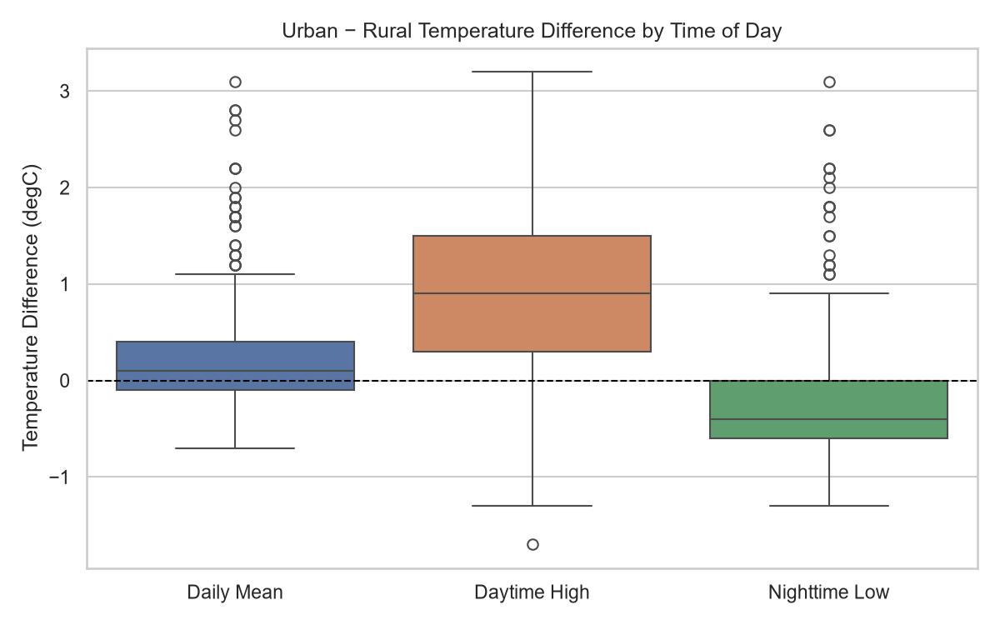
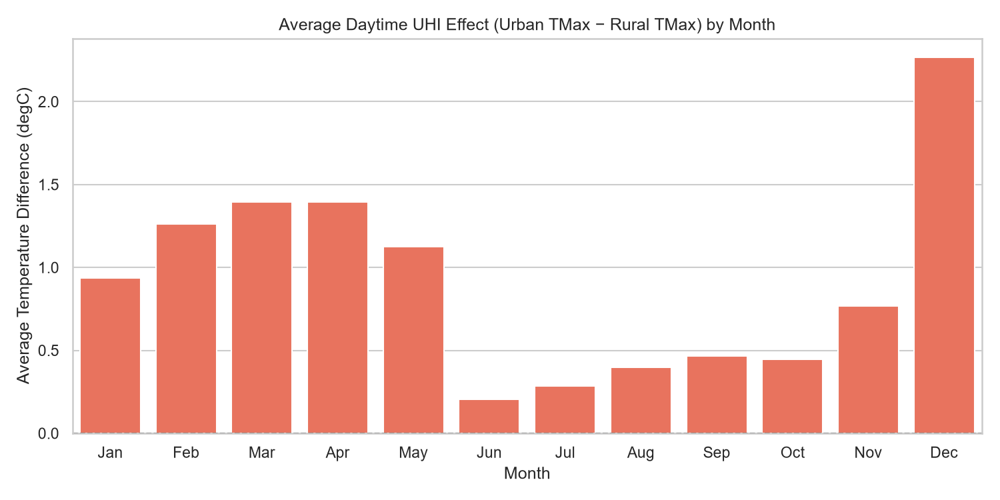

# Urban Heat Island (UHI) Effect Analysis — Lagos State, Nigeria

An investigation into whether, and how, urbanization measurably warms Lagos, Nigeria, using real 2024 temperature data rather than assumptions.



## 1. Problem statement

Rapid, largely unplanned urbanization has replaced much of Lagos's original vegetation and wetlands with asphalt, concrete, and dense construction. These surfaces absorb and re-radiate more solar heat than natural land cover, a well-documented phenomenon known as the **Urban Heat Island (UHI) effect**. Left unquantified, UHI intensity is easy to either overstate (assuming cities are uniformly and constantly hotter) or ignore in local planning decisions — like where to prioritize green space, or how building codes should account for heat exposure.

This project asks a narrower, testable question: **using real temperature data, is there a measurable UHI effect in Lagos, and if so, what does its shape actually look like — is it constant, or does it vary by time of day and season?**

## 2. Research objectives

1. Establish whether a public, freely available dataset can support this analysis credibly, given that no rural ground weather station exists near Lagos.
2. Quantify the temperature difference between an urban and a rural location in Lagos State across 2024.
3. Determine whether the effect is uniform across the day (both daytime highs and nighttime lows) or concentrated in one.
4. Determine whether the effect is uniform across the year or varies by season.

## 3. Study area

| Point | Role | Location | Rationale |
|---|---|---|---|
| Ikeja | Urban | 6.5774°N, 3.3210°E (Lagos mainland) | Dense, built-up area; coincides with the only public weather station near Lagos, enabling validation |
| Epe | Rural | 6.5833°N, 3.9833°E | A predominantly agrarian LGA in eastern Lagos State, chosen as the most defensible real rural proxy available |

## 4. Data and methodology

### 4.1 Data sources

No public rural weather station exists near Lagos, so this project combines two real, freely available sources rather than relying on simulated data:

| Source | What it provides | Access |
|---|---|---|
| [Open-Meteo Historical Weather API](https://open-meteo.com/en/docs/historical-weather-api) (ERA5-Land reanalysis, ECMWF) | Daily max/min/mean temperature at both the urban and rural points | Free, no API key |
| [NOAA GHCN-Daily](https://www.ncei.noaa.gov/pub/data/ghcn/daily/), station `NIM00065201` | Real ground observations from Murtala Muhammed International Airport, Lagos | Free, public archive |

ERA5-Land is a reanalysis product — real observations, satellite data, and a physical land-surface model blended onto a ~9 km grid. It stands in for both points here because rural Nigeria has no public station network, but that makes independent validation essential before trusting it (Section 4.2).

The full pipeline is reproducible with one command:

```bash
python scripts/fetch_data.py
```

which pulls both sources fresh and rebuilds `data/lagos_uhi_2024.csv` and `data/lagos_airport_station_2024.csv`.

### 4.2 Validation

Before using ERA5-Land as a stand-in for ground truth, its urban-point series is checked against the real NOAA station at almost the same coordinates:

| Metric | Daytime high (TMax) | Nighttime low (TMin) |
|---|---|---|
| Mean absolute error vs. real station | 1.36°C | 1.02°C |
| Correlation (r) | 0.90 | 0.63 |

**Conclusion of the validation step**: the reanalysis is trustworthy enough for the daytime comparison (strong agreement). Nighttime agreement is weaker, so any nighttime finding below is treated as provisional rather than settled (see Section 7).

### 4.3 Analytical approach

1. Merge the two ERA5-Land series into a single daily urban/rural dataset for 2024.
2. Validate the urban series against the real station (Section 4.2) before drawing conclusions.
3. Compare daily mean temperatures, then decompose the comparison into daytime highs (TMax) vs. nighttime lows (TMin), since averaging both together can hide opposite-signed effects.
4. Aggregate the daytime difference by calendar month to test for seasonality.

Full, executable code for every step is in [`notebooks/uhi_lagos_analysis.ipynb`](notebooks/uhi_lagos_analysis.ipynb).

## 5. Results

| Metric | Value |
|---|---|
| Average daytime UHI effect (urban TMax − rural TMax) | +0.91°C |
| Maximum daytime UHI effect | +3.20°C |
| Average nighttime difference (urban TMin − rural TMin) | −0.21°C |
| Days urban daytime high exceeds rural | 311 / 366 (~85%) |
| Daytime effect, dry season (Nov–May) | +0.9°C to +1.4°C (up to +2.3°C in December) |
| Daytime effect, rainy season (Jun–Oct) | +0.2°C to +0.5°C |

<p float="left">
  
  
</p>

## 6. Discussion

**The effect exists, but it is a daytime phenomenon, not a 24-hour one.** Daytime highs in Ikeja run about 0.9°C above Epe on average — a real, if modest, UHI signal consistent with built surfaces absorbing more solar heat. Nighttime lows show no equivalent warming; Ikeja is, on average, marginally *cooler* than Epe overnight, the opposite of the classic "city traps heat overnight" pattern. A plausible explanation is that both points sit near the Lagos coastline/lagoon system, and nighttime sea/lagoon breezes may moderate urban cooling more than land use alone would predict — though the weaker nighttime validation in Section 4.2 means measurement noise cannot be ruled out either.

**The effect is strongly seasonal.** The daytime UHI signal is 2–3x stronger in the dry season than the rainy season, peaking above +2°C in December. This tracks with Lagos's climate: rainy-season cloud cover and evaporative cooling suppress solar heating almost everywhere, narrowing the urban-rural gap, while sunnier, drier months let the urban surface's extra heat absorption show through. December's spike coincides with the Harmattan, when dry, dusty, low-cloud conditions widen daytime temperature extremes regionally.

**Why this matters methodologically**: a single flat "urban is X° hotter" number would have hidden both findings above. Splitting by time of day and by season surfaced a more accurate — and more interesting — picture than a naive comparison would have.

## 7. Limitations

- **Spatial resolution**: ERA5-Land's ~9 km grid cells blend urban and surrounding land cover, diluting the true urban heat signal compared to ground-level conditions in central Lagos. Satellite land-surface temperature (MODIS MOD11A2 or Landsat 8/9 thermal bands, both accessible via Google Earth Engine) would resolve intra-city variation far better and is the natural next iteration of this project.
- **Two-point comparison**: this compares one urban and one rural point, not a full urban-vs-rural land-cover classification across Lagos State. A raster-based approach (comparing average land-surface temperature across built-up vs. vegetated/agricultural pixels) would be more robust.
- **Single rural proxy**: Epe was chosen as a genuinely agrarian LGA, but its own proximity to the Lagos Lagoon may moderate its temperatures in ways that don't generalize to all rural areas of the state.
- **Nighttime validation gap**: weaker station agreement for TMin (r = 0.63, Section 4.2) means the nighttime finding in Section 6 should be treated as a hypothesis pending better nighttime data, not a settled result.
- **Single year of data**: 2024 alone cannot separate a genuine climatological pattern from one year's weather variability; multi-year data would let the seasonal analysis distinguish trend from noise.

## 8. Conclusion

Using real, validated 2024 temperature data, this analysis finds a genuine but modest Urban Heat Island effect in Lagos — concentrated in daytime hours, averaging +0.9°C and reaching +3.2°C on the most extreme days, and 2–3x stronger in the dry season than the rainy season. This is a smaller and more conditional effect than intuition (or a synthetic dataset) would suggest, which is the central takeaway: real data forces a more careful, falsifiable claim than "cities are hotter," and following that data honestly — including validating it and reporting where it disagrees with expectations — produces a more credible result than starting from the textbook answer.

## Project structure

```
UHI_Analysis/
├── data/
│   ├── raw/                              # untouched API/station responses
│   │   ├── era5_urban_ikeja.json
│   │   ├── era5_rural_epe.json
│   │   └── lagos_airport_ghcn.csv.gz
│   ├── lagos_uhi_2024.csv                # merged, analysis-ready urban/rural dataset
│   └── lagos_airport_station_2024.csv    # real station observations, for validation
├── scripts/
│   └── fetch_data.py                     # reproducible pull from Open-Meteo + NOAA
├── notebooks/
│   └── uhi_lagos_analysis.ipynb          # full analysis notebook
├── images/                                # exported charts (used in this README)
├── requirements.txt
└── README.md
```

## How to run

```bash
git clone https://github.com/ChristechAnalytics/UHI_Analysis.git
cd UHI_Analysis
pip install -r requirements.txt
python scripts/fetch_data.py          # optional: refresh the data from source
jupyter notebook notebooks/uhi_lagos_analysis.ipynb
```

## Tech stack

Python, pandas, NumPy, Matplotlib, Seaborn, Jupyter — Open-Meteo (ERA5-Land) and NOAA GHCN-Daily as data sources.

## Author

Christopher Onyeneke — [Christech Analytics](https://github.com/ChristechAnalytics)
