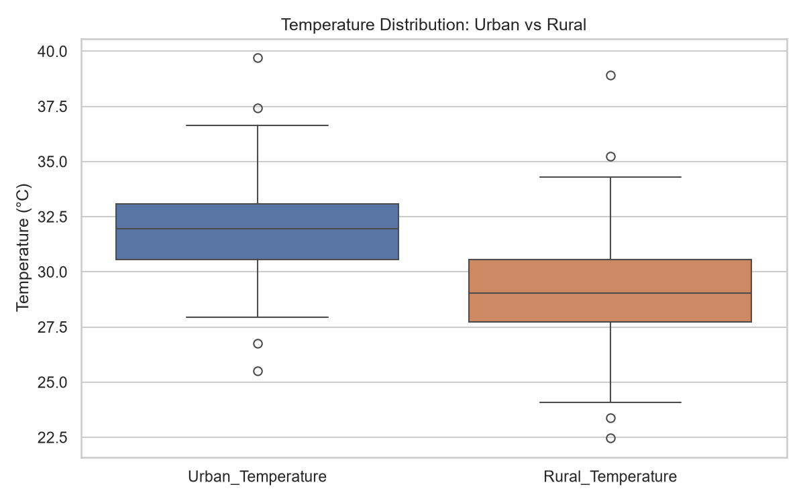

# Urban Heat Island (UHI) Effect Analysis — Lagos State, Nigeria

Analysis of the **Urban Heat Island effect** in Lagos State, Nigeria: comparing daily urban vs. rural temperatures across 2024 to quantify how much warmer built-up areas run compared to nearby rural areas, and how that gap changes through the year.


## Background

The Urban Heat Island effect describes how cities tend to be significantly warmer than their surrounding rural areas, mainly due to reduced vegetation, heat-retaining surfaces (asphalt, concrete), and waste heat from human activity. This project puts that concept into practice with a full, small-scale analysis workflow: load data, clean it, visualize trends, and summarize findings.

## Objectives

- Compare urban vs. rural daily temperature trends over a full year.
- Quantify the average and peak magnitude of the UHI effect (urban − rural temperature difference).
- Identify seasonal patterns in how the UHI effect changes month to month.

## Data

- [`data/urban_heat_island_demo.xlsx`](data/urban_heat_island_demo.xlsx) — daily temperature readings for urban and rural areas of Lagos State, January 1 – December 31, 2024 (366 days).
- Columns: `Date`, `Urban_Temperature`, `Rural_Temperature`, `Temperature_Difference`.
- **This dataset is simulated**, generated to reflect realistic UHI patterns for Lagos rather than pulled from a live sensor or satellite feed. It was built for practicing and demonstrating this analysis workflow. See [Limitations](#limitations--next-steps) for how this would be extended with real data.

## Key findings

| Metric | Value |
|---|---|
| Mean urban temperature | 31.9°C |
| Mean rural temperature | 29.1°C |
| Average UHI effect (urban − rural) | +2.79°C |
| Maximum UHI effect | +6.76°C |
| Days urban warmer than rural | 354 / 366 (~97%) |
| Urban–rural correlation | r ≈ 0.77 |

Urban and rural temperatures move together (both follow the same broader weather patterns), but urban areas run consistently 2–3°C hotter on top of that — the signature of the UHI effect. The gap is present in every month, peaking around February and easing slightly in October.

<p float="left">
  
  
</p>

## Conclusion

The results illustrate the kind of impact urbanization can have on local temperatures in a city like Lagos: a persistent multi-degree gap between built-up and rural areas. Urban planners can mitigate this through expanded green spaces, increased tree cover, and building materials/designs with lower heat retention.

## Limitations & next steps

- The dataset is simulated, not observed — real magnitude/seasonality would need validation against actual station data or satellite land surface temperature (e.g. MODIS/Landsat).
- With real data, next steps would include controlling for confounders (humidity, wind, rainfall) and analyzing the effect at a sub-city (neighborhood) resolution instead of a single urban/rural pair.

## Project structure

```
UHI_Analysis/
├── data/
│   └── urban_heat_island_demo.xlsx    # simulated daily temperature data
├── notebooks/
│   └── uhi_lagos_analysis.ipynb       # full analysis notebook
├── images/                            # exported charts (used in this README)
├── requirements.txt
└── README.md
```

## How to run

```bash
git clone https://github.com/ChristechAnalytics/UHI_Analysis.git
cd UHI_Analysis
pip install -r requirements.txt
jupyter notebook notebooks/uhi_lagos_analysis.ipynb
```

## Tech stack

Python, pandas, NumPy, Matplotlib, Seaborn, Jupyter

## Author

Christopher Onyeneke — [Christech Analytics](https://github.com/ChristechAnalytics)
